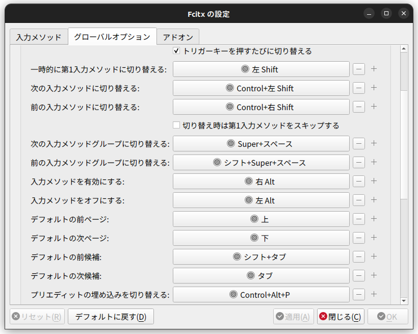

# Ubuntu

## よもやま

インストールのときにアップデートを一緒にインストールするとログインループという状態に陥るので必ずチェックを外す。
ドライバを一緒にインストールするのはやったほうが楽。

snap でのインストールは、現時点では日本語が打てない問題が起きがちで、避けたほうがいい。[各パッケージが対応版を出してくれないとだめらしい](https://forum.snapcraft.io/t/compatibility-with-cjkv-input-method-frameworks/7788)

## 各種設定

### ダウンロードフォルダなどを英語化

```
LANG=C xdg-user-dirs-gtk-update
```

### visudo のエディタを変更

```bash
sudo update-alternatives --config editor
```

### wake on lan

https://blog.freebsd-days.com/2020/08/enable-wol-on-linux/ を参考にした

```
sudo apt install ethtool

# id や MAC アドレスを確認
ip add show
2: enp34s0: <BROADCAST,MULTICAST,UP,LOWER_UP>...
    link/ether {MACアドレス} brd ff:ff:ff:ff:ff:ff

# Wake on lan が無効なのか調べる。d なら無効
sudo ethtool enp34s0
Wake-on: d

# 手動で有効にしてみる
sudo ethtool -s enp34s0 wol g
sudo ethtool enp34s0
Wake-on: g

# 恒久化
sudo vi /etc/netplan/99-enp34s0.yaml
```

/etc/netplan/99-enp34s0.yaml の中身↓

```yaml
network:
  ethernets:
    enp34s0:
      match:
        macaddress: {MACアドレス}
      dhcp4: true
      wakeonlan: true
  version: 2
```

### Fcitx

以下でインストール。

```bash
$ sudo apt install fcitx5-mozc
$ im-config -n fcitx5
```

下記のように設定すれば、 ALT キー空打ちで日本語入力を切り替えられる。


