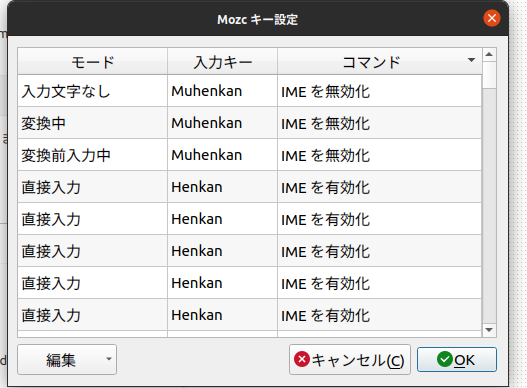

# Ubuntu

## よもやま

インストールのときにアップデートを一緒にインストールするとログインループという状態に陥るので必ずチェックを外す。
ドライバを一緒にインストールするのはやったほうが楽。

snap でのインストールは、現時点では日本語が打てない問題が起きがちで、避けたほうがいい。[各パッケージが対応版を出してくれないとだめらしい](https://forum.snapcraft.io/t/compatibility-with-cjkv-input-method-frameworks/7788)

[homebrew](https://brew.sh/) を早い段階で入れて、諸々のインストールはそれでやる方針。多分邪道。

## 各種設定

### ダウンロードフォルダなどを英語化

```
LANG=C xdg-user-dirs-gtk-update
```

### visudo のエディタを変更

```bash
sudo update-alternatives --config editor
```

### wake on lan

https://blog.freebsd-days.com/2020/08/enable-wol-on-linux/ を参考にした

```
sudo apt install ethtool

# id や MAC アドレスを確認
ip add show
2: enp34s0: <BROADCAST,MULTICAST,UP,LOWER_UP>...
    link/ether {MACアドレス} brd ff:ff:ff:ff:ff:ff

# Wake on lan が無効なのか調べる。d なら無効
sudo ethtool enp34s0
Wake-on: d

# 手動で有効にしてみる
sudo ethtool -s enp34s0 wol g
sudo ethtool enp34s0
Wake-on: g

# 恒久化
sudo vi /etc/netplan/99-enp34s0.yaml
```

/etc/netplan/99-enp34s0.yaml の中身↓

```yaml
network:
  ethernets:
    enp34s0:
      match:
        macaddress: {MACアドレス}
      dhcp4: true
      wakeonlan: true
  version: 2
```

### pbcopy, pbpaste

xsel は（多分）最初から入ってるはず

```fish
alias pbcopy 'xsel --clipboard --input'
alias pbpaste 'xsel --clipboard --output'
```

## 各種インストール


### Google Chrome

deb を落としてソフトウェアのインストールを選んでもエラーでインストールできない。(2020/12)
`sudo dpkg -i google-chrome-stable.deb` でインストールする。

### xkeysnail

https://github.com/mooz/xkeysnail よりインストール後に下記を順々に実行。

`type xkeysnail` で場所を確認し、 `/usr/local/bin/xkeysnail` 以外の場所に入ってたら `.xkeysnail/start.sh` の編集および下記のスクリプトの修正も必要。

```bash
cd ~
ln -s ~/ghq/github.com/macoshita/dotfiles/.xkeysnail
ln -s ~/ghq/github.com/macoshita/dotfiles/.config/autostart/xkeysnail.desktop .config/autostart/
sudo visudo /etc/sudoers.d/xkeysnail
# macoshita ALL=(ALL) NOPASSWD: /usr/local/bin/xkeysnail
```

`.xkeysnail/config.py` は現状下記の設定がなされる

- 右 ALT 単体押しで「変換」
- 左 ALT 単体押しで「無変換」
- CAPS LOCK を CTRL にできる。

あとは Mozc の設定で下記のようにしてやれば、左右 ALT 単体押しで IME の有効・無効を切り替えられる。



